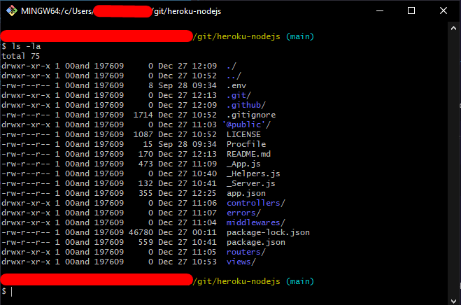
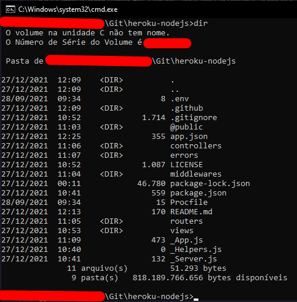

    

Um simples template para fazer o deploy de aplicações NodeJS com Express no Heroku.

### Recursos
- [Controller File Preset](https://github.com/Syn-Group/heroku-nodejs/blob/main/controllers/homeController.js)
- [Middleware File Preset](https://github.com/Syn-Group/heroku-nodejs/blob/main/middlewares/middleware.js)
- [Helpers File Preset](https://github.com/Syn-Group/heroku-nodejs/blob/main/_Helpers.js)
- [Router File Preset](https://github.com/Syn-Group/heroku-nodejs/blob/main/routers/router.js)
- [Handler (Error) File Preset](https://github.com/Syn-Group/heroku-nodejs/blob/main/errors/handler.js) - 404 Page
- [Public Dir Preset](https://github.com/Syn-Group/heroku-nodejs/tree/main/%40public)

## Baixando o template
Para efetuar a instalação do template, é preciso clonar o [repositório do template](https://github.com/Syn-Group/heroku-nodejs).

### Clonando o repositório
    git clone https://github.com/Syn-Group/heroku-nodejs
Após isso, é preciso navegar até o repositório onde o template foi baixado.

### Navegando até o repositório
    cd heroku-nodejs

### Conferindo todos os arquivos
É preciso verificar se você executou todos os passos corretos até aqui. Na pasta onde o repositório foi clonado, você verá estruturas parecidas com as estruturas abaixo:

#### __Linux: `ls -la`__

#### __Windows: `dir`__

## Instalando o template
Para instalar o template é simples, como em qualquer outra aplicação NodeJS.

A primeira coisa a ser feita é instalar todas as dependências da aplicação. A lista dessas dependências ficam armazenadas no arquivo [package.json](https://github.com/Syn-Group/heroku-nodejs/blob/main/package.json)

Na pasta onde o repositório foi clonado, você irá executar o seguinte comando:

    npm install 
Este comando fará com que o NPM leia o arquivo `package.json` e instale todas as dependências que estão listadas.

## Iniciando o servidor
Para abrir o servidor é simples, basta você iniciar o arquivo `_Server.js` localizado na pasta root do repositório `(heroku-nodejs)`.

    npm start
ou
    
    node _Server.js